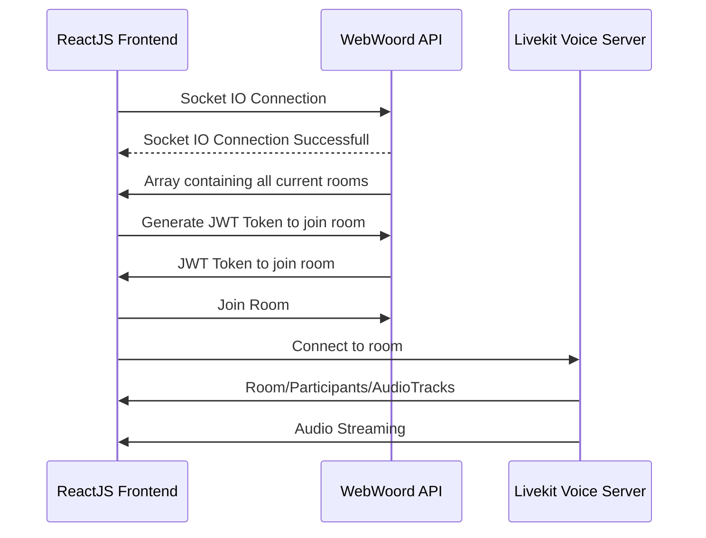
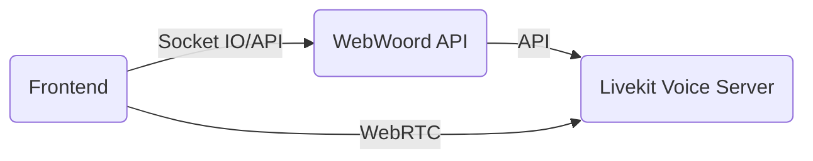

# WebWoord API Server

Express & Socket IO server for interface between WebWoord Frontend (ReactJS) and WebWoord Voice Server (Livekit)

# Local Deployment

Deploy locally for dev/testing

#### Clone repo

```bash
sudo git clone https://github.com/MrTwister96/webwoord-api-server.git /opt/webwoord-api
cd /opt/webwoord-api
```

#### Edit the `.enc` file to add all the required env variables

```bash
sudo nano .env
```

```bash
LIVEKIT_SERVER=https://livekitserver.domain.com/ #HTTPS URL for your livekit voice server
LIVEKIT_API_KEY=XXXXXXXXXXXXXXX #API Key for your livekit voice server
LIVEIT_API_SECRET=XXXXXXXXXXXXXXXXXXXXXXXXXXXXXXXXXXXXXXXXXXXX #API Secret for you livekit voice server
CORS_ORIGIN="https://host1.domain.com https://host2.domain.com" #CORS allowed hosts seperated by spaces
```

#### Install dependencies and run

```bash
npm install

npm run start
```

# Production Deployment

This deployment guide was meant for Ubuntu Server 20.04

## Preperation

#### Update all current packages and install required packages

```bash
sudo apt update
sudo apt upgrade
sudo apt install -y docker.io nginx certbot python3-certbot-nginx
```

#### Clone repo

```bash
sudo git clone https://github.com/MrTwister96/webwoord-api-server.git /opt/webwoord-api
cd /opt/webwoord-api
```

## NodeJS Docker Setup

#### Edit the `env.list` file to add all the required env variables

```bash
sudo nano env.list
```

```bash
LIVEKIT_SERVER=https://livekitserver.domain.com/ #HTTPS URL for your livekit voice server
LIVEKIT_API_KEY=XXXXXXXXXXXXXXX #API Key for your livekit voice server
LIVEIT_API_SECRET=XXXXXXXXXXXXXXXXXXXXXXXXXXXXXXXXXXXXXXXXXXXX #API Secret for you livekit voice server
CORS_ORIGIN="https://host1.domain.com https://host2.domain.com" #CORS allowed hosts seperated by spaces
```

#### Build image and run container

> **Tip:** You can run `docker ps` to check if the container is running.

```bash
sudo docker build . -t webwoord-api
sudo docker run -p 5000:5000 -d --env-file /opt/webwoord-api/env.list webwoord-api
```

> **Tip:** You can run `netstat -plnt` to check if the server is listening on port tcp/5000.

#### Commands to confirm:

```bash
# Check if container is running
sudo docker ps

# Check if port is listening
netstat -plnt
```

## NGINX SSL Reverse Proxy Setup

#### Edit NGINX Configuration

```bash
sudo nano /opt/webwoord-api/webwoord-api-nginx.conf
```

Edit where marked with `#`

```bash
server {
    server_name yourapi.domain.com; #This should match your DNS entry
    listen 80;
    listen [::]:80;

    location / {
        add_header 'Access-Control-Allow-Origin'  'https://yourfrontend.domain.com'; #This should match the docker CORS Origin configuration

        proxy_pass http://127.0.0.1:5000;
        proxy_http_version 1.1;
        proxy_set_header Upgrade $http_upgrade;
        proxy_set_header Connection "upgrade";
        proxy_read_timeout 86400;
    }
}
```

#### Copy config and restart NGINX

```bash
sudo cp /opt/webwoord-api/webwoord-api-nginx.conf /etc/nginx/sites-available/webwoord-api-nginx.conf
sudo ln -s /etc/nginx/sites-available/webwoord-api-nginx.conf /etc/nginx/sites-enabled/webwoord-api-nginx.conf
sudo systemctl restart nginx
```

#### Configure UFW (If applicable)

```bash
sudo ufw allow 'Nginx Full'
sudo ufw reload
```

#### Generate Let's Encrypt SSL Cert

This will as you some questions after which the cert will be generated and verified. Make sure that your DNS A record is pointing to your server.

```bash
sudo certbot --nginx -d <yourapi.domain.com>
```

#### Setup Cert renewal crontab

```bash
crontab -e

0 5 \* \* \* /usr/bin/certbot renew --quiet
```

## Application flow

Sequence Diagram



Flow Chart


